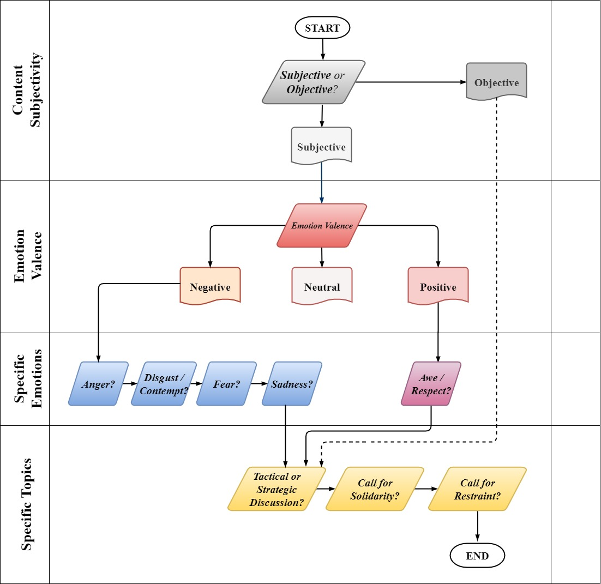

# LIHKG_sentiment_coding
&nbsp;&nbsp;&nbsp;&nbsp;&nbsp;&nbsp;A webpage for LIHKG manual coding 
&nbsp;&nbsp;&nbsp;&nbsp;&nbsp;&nbsp;Emotion is a powerful commitment device (Frank, 1988). Political psychology literature has established a persistent association between emotions and political participation behaviors. However, the question of “which emotions play what role” still remains highly debated with conflicting results derived from different contexts. Pertaining to Hong Kong’s context, previous survey data have found that fear and anger were important in mobilizing citizens to partake in the protest. The widespread fear and anger might serve as a common ground to unite people from all walks of life and bring out solidarity across the board. Against this backdrop, current project is aimed to advance our understanding of how emotions shape the solidarity on social media. The analysis draws on more than 28 million posts collected from LIHKG between April 2019 and July 2020.

